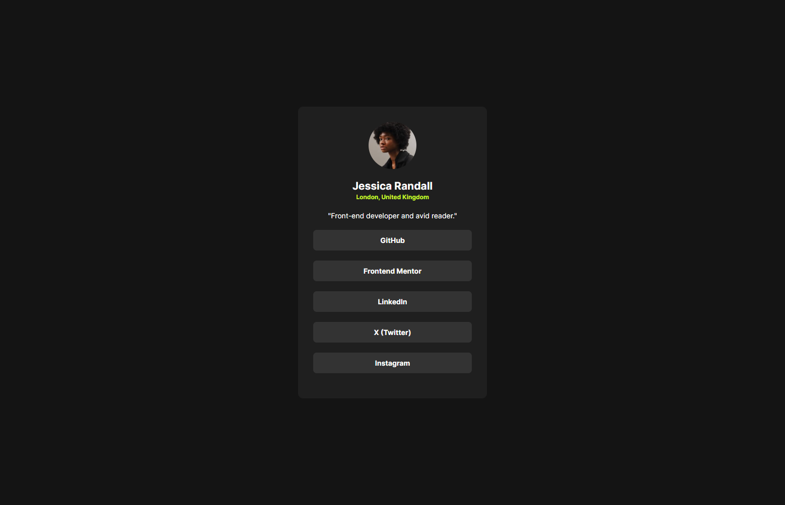
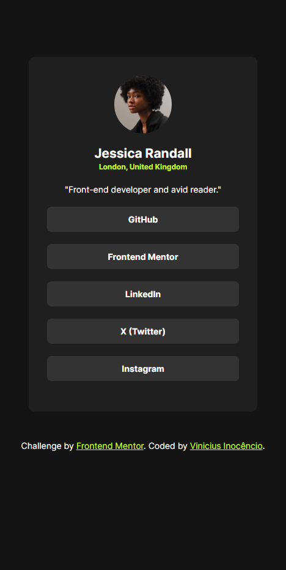

# Social Links Profile

Este é um projeto de **landing page** simples de apresentação de um usuário, desenvolvido com **HTML** e **CSS**, destinado a aprender e praticar os conceitos básicos de desenvolvimento web.

## Descrição

A landing page foi criada para fins educacionais e serve como ponto de partida para entender a estrutura de uma página web básica. Ela demonstra a utilização de elementos HTML e técnicas de layout e estilização com CSS, como **flexbox** e **grid**.

## Funcionalidades

- **Estrutura HTML**: Utilização de tags básicas como `<header>`, `<section>`, `
`, `<main>`, entre outras.
- **Estilização com CSS**: Aplicação de estilos como cores, fontes, alinhamentos e espaçamentos.
- **Layout responsivo básico**: A página se adapta a diferentes tamanhos de tela, utilizando práticas simples de design responsivo, aproveitando propriedades como **grid**, **flexbox** e **media queries**.

## Tecnologias Utilizadas

- **HTML5**
- **CSS3**

## Resultados da Landing Page:

### Versão Desktop

### Versão Mobile

 

<a href="https://inocenciooo.github.io/social-links-profile/" target="_blanck">Acesse aqui</a> para visualizar o projeto no <strong>GitHub Pages</strong> com mais detalhes!

## Contribuições e Sugestões

Este projeto está sendo desenvolvido como parte do meu aprendizado em front-end. Sinta-se à vontade para sugerir melhorias ou fazer contribuições.